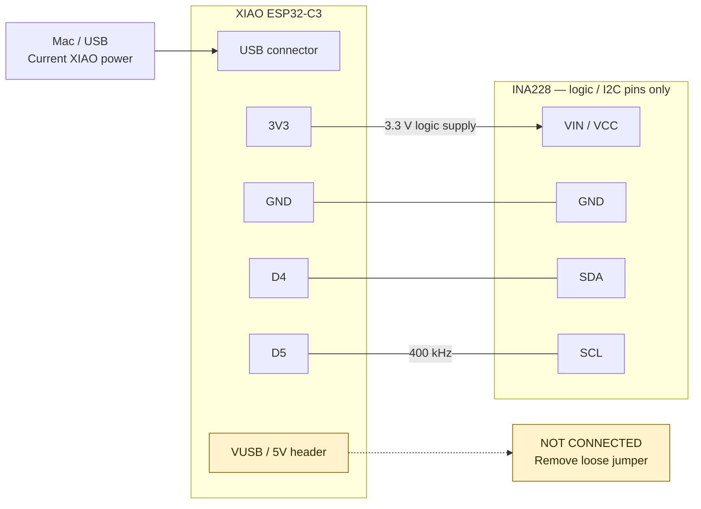

# Hardware wiring

Canonical current bench wiring, documented **2026-09-24** from the user's
description. Physical connections below are user-reported, not independently
inspected or measured in this documentation stint. Firmware confirms the I2C
pin configuration and bus speed; it cannot establish physical terminal routing.

## CURRENT — low-power logic and I2C

The **Mac supplies the XIAO ESP32-C3 through USB**. The INA228 logic supply
comes from **XIAO 3V3**. The battery/solar measurement path does not currently
power the XIAO.

| XIAO ESP32-C3 connection | Destination | Role |
| --- | --- | --- |
| USB connector | Mac / USB | Current XIAO power source |
| 3V3 | INA228 VIN / VCC | 3.3 V logic supply |
| GND | INA228 GND | Logic ground |
| D4 | INA228 SDA | I2C data |
| D5 | INA228 SCL | I2C clock, 400 kHz |
| VUSB / 5V header | **NOT CONNECTED** to an external circuit | Not used in this bench setup |

**VIN / VCC here means the INA228 breakout's logic supply. It is distinct from
VIN+ / VIN− in the shunt measurement path.**

This is logical connectivity, not physical board or breadboard placement.
The dashed VUSB line is a **no-connection marker**, not a wire. A loose jumper
is currently plugged onto VUSB / 5V with its other end unconnected: leave that
end unconnected and preferably remove the jumper entirely. **Do not connect
VUSB to INA228 VIN/VCC.** “NOT CONNECTED” describes the external header wiring,
not a claim that the pin is unpowered while USB is attached.

Source checks: `setup()` and `runAutonomousWakeCycle()` in
[solar-logger.ino](../Arduino/solar-logger/solar-logger.ino) both use
`Wire.begin(D4, D5)` and `Wire.setClock(400000)`. The sketch also distinguishes
logic VIN from measurement VIN+ / VIN−. [ina228.h](../Arduino/solar-logger/ina228.h)
requires the caller to start the I2C bus before using the driver.

## CURRENT — high-current measurement path

The reported bench setup includes a SUNER solar controller, an INA228 board
with shunt, and a 12 V battery. [LAB_NOTES.md](LAB_NOTES.md#bench-setup) records
the bench battery as a jump pack battery removed from its case, with the solar
panel in a window. Current measurements are signed; the signed register reads
are implemented in [ina228.cpp](../Arduino/solar-logger/ina228.cpp).

These facts do **not** establish the physical connection order or polarity.
The repository does not unambiguously map controller positive/negative,
battery positive/negative, VIN+ / VIN−, and shunt orientation in the current
setup. Signed readings alone do not establish which physical direction is
positive. No exact measurement-path schematic is asserted here.

**OPEN QUESTION:** Exact current bench measurement-path diagram still needs to
be captured from the physical setup / photo before being declared canonical.

Capture readable terminal labels and trace each controller/battery lead,
VIN+ / VIN− connection, and shunt direction. Record the physical meaning of
positive and negative readings. This section separates measurement wiring
from logic power; it makes no claim of electrical isolation between them.

## FUTURE — battery-powered logger wiring

Vehicle-powered operation requires a proper regulator/protection stage from
vehicle battery voltage to an appropriate XIAO supply. That stage is **not part
of the current bench wiring**. The regulator, protection, supply input and any
VUSB / 5V scheme remain unchosen; no final power circuit is specified here.

The installation plan remains [PROJECT.md](PROJECT.md#installed-system-architecture--planned-not-installed-or-validated)
and D-052–D-054 in [DECISIONS.md](DECISIONS.md): first use the BMW under-hood
charging/jump points, with the logger in the glove box, BLE to iPhone and a
manual SYNC/wake button. V1 has no IBS tap or separate ignition/switched-12V
wire. These are future requirements, not current bench capabilities.

The later IBS/LIN phase likely moves the logger to the trunk. **Trunk-side
power/measurement topology remains OPEN**; physical location does not establish
that direct battery connection is correct. The research questions remain in
[BACKLOG.md](BACKLOG.md#bmw-charging-point-topology--open-research-before-any-trunk-side-decision).

## Historical power tests

The dated AA-battery/DMM tests in [LAB_NOTES.md](LAB_NOTES.md) used a 3xAA holder
on VUSB with USB physically disconnected during measurement. Their results and
conditions remain historical evidence. They do not describe today's USB-powered
bench wiring and do not choose the future vehicle-power circuit.
