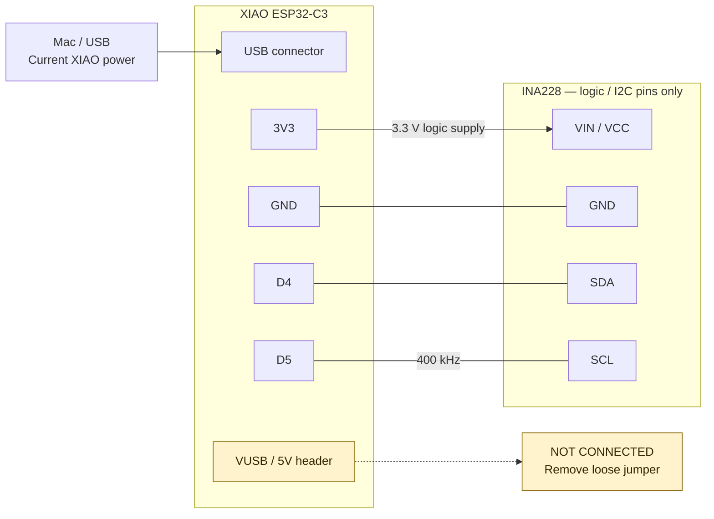

# Hardware wiring

Canonical current bench wiring, documented **2026-09-24** from the user's
description. Physical connections below are user-reported, not independently
inspected or measured in this documentation stint. Firmware confirms the I2C
pin configuration and bus speed; it cannot establish physical terminal routing.

## Hardware identity register — updated 2026-09-25

Record chip identity, purchased board identity and PCB revision separately.
Unknown fields stay explicit; never infer a manufacturer from a similar layout.
User-supplied listing evidence is preserved in
[evidence/2026-09-25/ina228-purchase-listing.png](../logs/evidence/2026-09-25/ina228-purchase-listing.png).

| Item | Known identity | Evidence / unresolved detail |
| --- | --- | --- |
| MCU development board | Seeed Studio XIAO ESP32-C3 | Existing project hardware and build target; actual PCB revision not recorded |
| Measurement IC | TI INA228 | Existing firmware identity checks and project record; this identifies the IC, not the breakout manufacturer |
| Purchased INA228 breakout | User identifies the supplied listing as the purchased board; listing storefront **Ubxvamm** | Screenshot title: “High Precisions 5832 INA228 20Bit Power Monitors Module for Voltages and Current Measurement with I2C Interfaces” |
| Listing identifier | **5832** occurs in the title | Not established as a PCB revision, manufacturer ID or verified Adafruit product identity |
| Actual breakout manufacturer / PCB revision | **UNVERIFIED / UNKNOWN** | Storefront name is known; screenshot does not independently establish the factory or a revision marking. Product URL/ASIN not supplied |
| Shunt | Nominal **15 mΩ**; project calibration **15.62 mΩ** | Listing image shows `R015`; calibrated value comes from prior project measurements, not the listing |
| Solar panel and charge controller | **SUNER POWER BC-12W Pro**, 12 W / 12 V waterproof solar battery charger and maintainer, **with the MPPT charge controller built into the panel assembly** | User-supplied listing, 2026-10-01. Listing title: "SUNER POWER Waterproof 12W 12V Solar Battery Charger & Maintainer Pro, Built-in UltraSmart MPPT Charge Controller". Sold in BC-5W / BC-10W / BC-12W Pro sizes; this is the 12 W. Listing ships SAE, alligator-clip and cigarette-lighter leads plus suction cups. Amazon flags the storefront "Suspect brand"; the MPPT claim is the vendor's and is not independently verified |
| Bench battery | **Mighty Max ML22-12**, 12 V 22 Ah sealed deep-cycle GEL, non-spillable | Photographed label, 2026-10-01. The label's charge table appears to read standby 13.5–13.8 V, cycle 14.5–14.9 V, initial current less than 6.6 A; read from a photograph, not transcribed from the datasheet. Supersedes nothing: LAB_NOTES describes this as a jump pack's battery removed from its case, and this is that battery's identity |
| Battery connection harness | **Bates SAE to O-ring harness**, 2 ft, 12 AWG, inline fuse holder, 5 A–25 A fuse assortment, SAE polarity-reverse adapter | User-supplied listing, 2026-10-01. Purchased for the vehicle connection, not yet installed or wired to anything |

The listing image shows two small white connectors, an R015 shunt, a terminal
block footprint and signal labels. Those similarities do not establish that the
purchased board follows an Adafruit schematic or BOM. A physical board photo
showing markings or verified vendor documentation is needed before identifying
an LED resistor/jumper to modify. No LED modification has been selected or made.

This register was missing: the docs described the chip and calibration but did
not preserve the purchase identity. Do not ask the user for the already-known
storefront/listing again; ask only for a still-needed missing field and say why.

## Fresh silicon identification — 2026-09-29

During the canonical storage upload, esptool identified ESP32-C3 QFN32, silicon
revision **v0.4**, embedded **4 MB XMC flash**, 40 MHz crystal and USB Serial/JTAG.
The subsequent held session read INA228 manufacturer **0x5449**, device **0x2281**,
revision **1**, with identity/configuration readback PASS. These are silicon/tool
observations; they do not identify either PCB revision or the breakout factory.
[Raw upload and session evidence](../logs/evidence/2026-09-29/storage-hardware/README.md).

## CURRENT — low-power logic and I2C

The **Mac supplies the XIAO ESP32-C3 through USB**. The INA228 logic supply
comes from **XIAO 3V3**. The battery/solar measurement path does not currently
power the XIAO.

| XIAO ESP32-C3 connection | Destination | Role |
| --- | --- | --- |
| USB connector | Mac / USB | Current XIAO power source |
| 3V3 | INA228 VIN / VCC | 3.3 V logic supply |
| GND | INA228 GND | Logic ground |
| D4 | INA228 SDA | I2C data |
| D5 | INA228 SCL | I2C clock, 400 kHz |
| VUSB / 5V header | **NOT CONNECTED** to an external circuit | Not used in this bench setup |

**VIN / VCC here means the INA228 breakout's logic supply. It is distinct from
VIN+ / VIN− in the shunt measurement path.**


```mermaid
flowchart LR
    mac["Mac / USB<br/>Current XIAO power"]
    subgraph xiao["XIAO ESP32-C3"]
        usb["USB connector"]
        v3["3V3"]
        gnd["GND"]
        d4["D4"]
        d5["D5"]
        vusb["VUSB / 5V header"]
    end
    subgraph ina["INA228 — logic / I2C pins only"]
        vin["VIN / VCC"]
        ignd["GND"]
        sda["SDA"]
        scl["SCL"]
    end
    mac --> usb
    v3 -->|"3.3 V logic supply"| vin
    gnd --- ignd
    d4 --- sda
    d5 ---|"400 kHz"| scl
    vusb -.-> nc["NOT CONNECTED<br/>Remove loose jumper"]
    classDef unused fill:#fff3cd,stroke:#856404,color:#332701;
    class vusb,nc unused;
```

This is logical connectivity, not physical board or breadboard placement.
The dashed VUSB line is a **no-connection marker**, not a wire. A loose jumper
is currently plugged onto VUSB / 5V with its other end unconnected: leave that
end unconnected and preferably remove the jumper entirely. **Do not connect
VUSB to INA228 VIN/VCC.** “NOT CONNECTED” describes the external header wiring,
not a claim that the pin is unpowered while USB is attached.

Source checks: `setup()` and `runAutonomousWakeCycle()` in
[solar-logger.ino](../Arduino/solar-logger/solar-logger.ino) both use
`Wire.begin(D4, D5)` and `Wire.setClock(400000)`. The sketch also distinguishes
logic VIN from measurement VIN+ / VIN−. [ina228.h](../Arduino/solar-logger/ina228.h)
requires the caller to start the I2C bus before using the driver.

## CURRENT — high-current measurement path

The reported bench setup includes the SUNER panel, an INA228 board with shunt,
and a 12 V battery. [LAB_NOTES.md](LAB_NOTES.md#bench-setup) records the bench
battery as a jump pack battery removed from its case, with the solar panel in a
window; the identity register above now names it as a Mighty Max ML22-12.
Current measurements are signed; the signed register reads are implemented in
[ina228.cpp](../Arduino/solar-logger/ina228.cpp).

**The charge controller is inside the panel assembly, not a separate box**
(established 2026-10-01 from the product listing). The chain is therefore:

```text
panel + built-in MPPT controller  ->  SAE lead  ->  [shunt / INA228]  ->  battery
```

There is no separate controller enclosure to place, wire or power. This settles a
question the enclosure planning in [BACKLOG.md](BACKLOG.md) had left open: the
logger's box sits between the panel's own output lead and the battery, and the
controller never enters it. It also means what arrives at the box is the
controller's regulated output, not the panel's open-circuit voltage.

At 12 W on a 12 V system the panel's output is on the order of 1 A, which is the
figure to size the harness fuse against; observed charging currents in the logged
records are a few hundred mA. The 12 W rating is the vendor's, not measured here.

### TRACED 2026-10-01 — the open question is closed

Traced by the operator on the live bench rig and reported directly. This
supersedes the "not yet physically traced" status this section carried from
2026-09-24. It is a user-reported trace of a working setup, not an independent
inspection or a continuity-meter check.

| From | To |
| --- | --- |
| SUNER **positive** output | INA228 **VIN+** |
| INA228 **VIN−** | Battery **positive** |
| SUNER **negative** output | Battery **negative** |
| Battery **negative** | Breadboard negative rail (XIAO and INA228 logic ground) |


```mermaid
flowchart LR
    panel["SUNER BC-12W Pro<br/>panel + built-in MPPT"]
    vinp["VIN+"]
    shunt["shunt 15.62 mΩ"]
    vinn["VIN−"]
    batt["Mighty Max ML22-12<br/>12 V 22 Ah gel"]
    rail["Breadboard negative rail<br/>XIAO + INA228 logic ground"]

    panel -->|"POS"| vinp
    vinp --> shunt
    shunt --> vinn
    vinn -->|"to battery POS"| batt
    batt -->|"NEG"| common(("common<br/>negative"))
    panel -->|"NEG"| common
    common --- rail
```

**The shunt sits in the positive leg between the controller and the battery.**
Charge current therefore flows into VIN+ and out of VIN−.

**What the sign means, established rather than assumed.** A positive reading is
current flowing from the controller into the battery, which is charging. A
negative reading is current flowing the other way, out of the battery toward the
controller. Two things agree on this: the traced direction above, and the logged
data — the 2026-09-24 ON transition recorded +178 mA and +262 mA while the panel
was known to be charging, and the resting log shows roughly −0.6 mA, the small
reverse draw of an idle controller. The standard INA228 convention is that
current entering IN+ and leaving IN− reads positive, which matches; confirm
against SLYS021A before relying on the convention rather than on this agreement.

**The 2026-09-24 inference is now CONFIRMED by topology, not just by telemetry.**
That experiment concluded the INA228 observes controller output rather than net
battery current, because a nominal ~1.07 A resistive load did not appear as a
−1 A shift. The trace explains exactly why: a load placed across the battery
runs from battery positive to battery negative and never passes through the
shunt, which is upstream in the controller leg. The inference and the wiring
agree.

**Scope consequence, and it matters for the installed goal.** This topology
measures what the panel delivers, and nothing else. Any load on the battery —
in the car, the vehicle's own parasitic drain — is invisible to it. That is the
right instrument for "is the panel actually charging, and how much," and it is
*not* sufficient for "is the battery net gaining or losing charge."

That is deliberate, and it is the project's phase boundary rather than a gap.
Phases 1 and 1.5 answer the first question with this topology; the second is
phase 2 and is what the IBS integration exists for. See the phase table in
[PROJECT.md](PROJECT.md#installed-system-architecture--planned-not-installed-or-validated).
No change to this wiring would answer the phase 2 question, because the drain it
would need to see is on the other side of the battery terminal.

**Consequence for the vehicle build:** power the logger from the battery side,
downstream of the shunt. Its own consumption then returns through the battery
negative without crossing the shunt, so the logger does not measure itself. The
alternative, powering it from the controller side, would subtract the logger's
own draw from every charge reading.

This section separates measurement wiring from logic power; it makes no claim of
electrical isolation between them. The logic ground and the battery negative are
the same node.

**Still unstated:** which node the INA228's `VBUS` pin senses. The logged bus
voltage of about 13.07 V is consistent with it sensing the battery side, and
with a resting gel battery, but the connection has not been reported.

## FUTURE — battery-powered logger wiring

Vehicle-powered operation requires a proper regulator/protection stage from
vehicle battery voltage to an appropriate XIAO supply. That stage is **not part
of the current bench wiring**. The regulator, protection, supply input and any
VUSB / 5V scheme remain unchosen; no final power circuit is specified here.

The installation plan remains [PROJECT.md](PROJECT.md#installed-system-architecture--planned-not-installed-or-validated)
and D-052–D-054 in [DECISIONS.md](DECISIONS.md): first use the BMW under-hood
charging/jump points, with the logger in the glove box, BLE to iPhone and a
manual SYNC/wake button. V1 has no IBS tap or separate ignition/switched-12V
wire. These are future requirements, not current bench capabilities.

**Confirmed by the operator, 2026-10-01:** on this vehicle the battery is in the
**trunk**, with the IBS cable on it, and V1 connects to the **under-hood charging
posts** — not to battery posts, which are not under the hood at all. This
confirms the premise that BACKLOG's topology research was written against, and it
is the reason the harness's two ring terminals land on the designated under-hood
points rather than on the battery itself. It does not answer any of that
research: whether a connection made at those posts is observable to the IBS, and
whether the positive and negative rules differ, both remain open.

The later IBS/LIN phase likely moves the logger to the trunk. **Trunk-side
power/measurement topology remains OPEN**; physical location does not establish
that direct battery connection is correct. The research questions remain in
[BACKLOG.md](BACKLOG.md#bmw-charging-point-topology--open-research-before-any-trunk-side-decision).

## Historical power tests

The dated AA-battery/DMM tests in [LAB_NOTES.md](LAB_NOTES.md) used a 3xAA holder
on VUSB with USB physically disconnected during measurement. Their results and
conditions remain historical evidence. They do not describe today's USB-powered
bench wiring and do not choose the future vehicle-power circuit.
